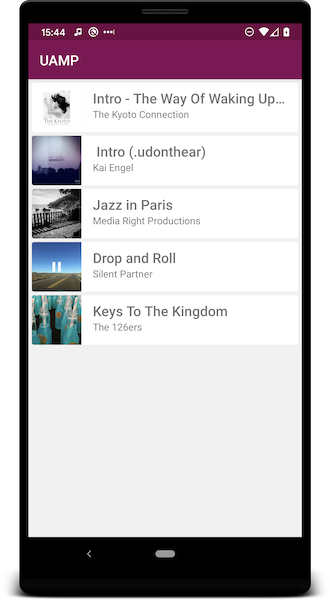
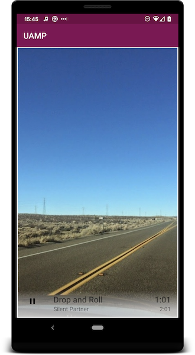

Universal Android Music Player Sample
=====================================
The goal of this sample is to show how to implement an audio media app that works
across multiple form factors and provides a consistent user experience
on Android phones, tablets, Android Auto, Android Wear, Android TV, Google Cast devices,
and with the Google Assistant. 

To get started with UAMP please read the [full guide](docs/FullGuide.md).

Pre-requisites
--------------

- Android Studio 3.x

Getting Started
---------------

This sample uses the Gradle build system. To build this project, use the
"gradlew build" command or use "Import Project" in Android Studio.

Support
-------

- Check out the [FAQs page](docs/FAQs.md)
- Stack Overflow: http://stackoverflow.com/questions/tagged/android

If you've found an error in this sample, please
[file an issue](https://github.com/android/UAMP/issues)

Patches are encouraged and may be submitted by forking this project and
submitting a pull request through GitHub. Please see [CONTRIBUTING.md](CONTRIBUTING.md) for more
details.

Audio
-----

Music provided by the [Free Music Archive](http://freemusicarchive.org/).

- [Wake Up](http://freemusicarchive.org/music/The_Kyoto_Connection/Wake_Up_1957/) by
[The Kyoto Connection](http://freemusicarchive.org/music/The_Kyoto_Connection/).

Recordings provided by the [Ambisonic Sound Library](https://library.soundfield.com/).

- [Pre Game Marching Band](https://library.soundfield.com/track/163) by Watson Wu
- [Chickens on a Farm](https://library.soundfield.com/track/129) by Watson Wu
- [Rural Market Busker](https://library.soundfield.com/track/55) by Stephan Schutze
- [Steamtrain Interior](https://library.soundfield.com/track/65) by Stephan Schutze
- [Rural Road Car Pass](https://library.soundfield.com/track/57) by Stephan Schutze
- [10 Feet from Shore](https://library.soundfield.com/track/114) by Watson Wu

License
-------

Copyright 2017 Google Inc.

Licensed to the Apache Software Foundation (ASF) under one or more contributor
license agreements.  See the NOTICE file distributed with this work for
additional information regarding copyright ownership.  The ASF licenses this
file to you under the Apache License, Version 2.0 (the "License"); you may not
use this file except in compliance with the License.  You may obtain a copy of
the License at

  http://www.apache.org/licenses/LICENSE-2.0

Unless required by applicable law or agreed to in writing, software
distributed under the License is distributed on an "AS IS" BASIS, WITHOUT
WARRANTIES OR CONDITIONS OF ANY KIND, either express or implied.  See the
License for the specific language governing permissions and limitations under
the License.
