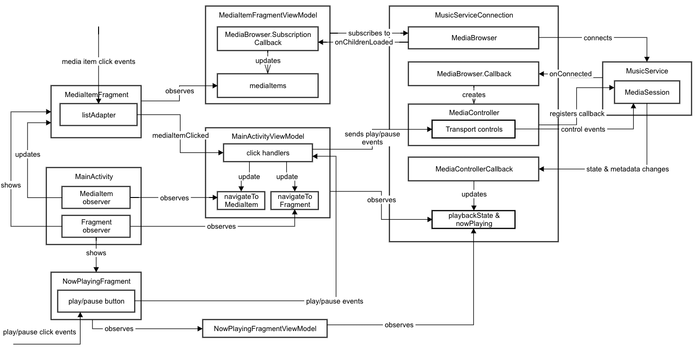

# Full Guide to UAMP

The Universal Android Music Player (UAMP) is an example music player app for Android written in [Kotlin](https://kotlinlang.org/). It supports many features including background playback, audio focus handling, multiple platforms (like Wear, TV and Auto) and assistant integration. 

It loads a [music catalog](https://storage.googleapis.com/uamp/catalog.json) from a remote server and allows the user to browse the albums and songs. Tapping on a song will play it through connected speakers or headphones. Under the hood it uses [ExoPlayer](https://exoplayer.dev/).

If your app's primary goal is to play audio, UAMP is a good place to start. 

Screenshots: Browse albums and play a song using UAMP

# Architecture overview

UAMP follows the client/server architecture as [described in the "how to build an audio app" official documentation](https://developer.android.com/guide/topics/media-apps/audio-app/building-an-audio-app).

Here's an architectural overview:

Diagram: Overall architecture of UAMP

# Server architecture  

## MusicService

The most important class on the server side is [MusicService](https://github.com/android/uamp/blob/master/common/src/main/java/com/example/android/uamp/media/MusicService.kt) which is a subclass of [MediaBrowserService](https://developer.android.com/reference/android/service/media/MediaBrowserService). MediaBrowserService allows [MediaBrowser](https://developer.android.com/guide/topics/media-apps/audio-app/building-a-mediabrowser-client.html) clients from UAMP and other applications to discover the service, connect to the media session and control playback.   

UAMP actually uses [MediaBrowserServiceCompat](https://developer.android.com/reference/androidx/media/MediaBrowserServiceCompat.html) - the backwards compatible version of MediaBrowserService provided by the [androidx.media library](https://developer.android.com/reference/androidx/media/package-summary) ([more information](https://medium.com/androiddevelopers/mediabrowserservicecompat-and-the-modern-media-playback-app-7959a5196d90)). 

MusicService is responsible for: 

*   the audio player (provided by [ExoPlayer](https://exoplayer.dev/))
*   a [media session](https://developer.android.com/guide/topics/media-apps/working-with-a-media-session) and objects to communicate with it 
*   maintaining a [notification](https://developer.android.com/guide/topics/ui/notifiers/notifications) which displays information and controls for the current media
*   loading [the media catalog](https://storage.googleapis.com/uamp/catalog.json) (a JSON file) from a remote URI and providing it to MediaBrowser clients

By keeping the objects responsible for audio playback inside a service it allows audio to be played in the background, decoupling playback from the app's UI.

Here's a more detailed view of MusicService.

Diagram: Detailed view of MusicService

## The media session and controller

A [MediaSession](https://developer.android.com/guide/topics/media-apps/working-with-a-media-session.html#top_of_page) represents an ongoing media playback session. It provides various mechanisms for controlling playback, receiving status updates and retrieving metadata about the current media. 

A [MediaController](https://developer.android.com/reference/android/support/v4/media/session/MediaControllerCompat.html) is used to communicate with the media session. It receives media button events and forwards them to the media session. State and metadata updates from the media session are performed through a [MediaController.Callback](https://developer.android.com/reference/android/support/v4/media/session/MediaControllerCompat.Callback.html).

Diagram (from the [official Android documentation](https://developer.android.com/guide/topics/media-apps/media-apps-overview#mediasession-and-mediacontroller)): Shows how MediaController and MediaSession communicate. 

UAMP uses two MediaControllers. One on the client side to communicate with the UI (explained later), and one inside MusicService to listen to media session state and metadata changes. This is then used to update the notification. 

## Notifying the user

Screenshot: Notification showing information about the current song being played and playback controls

A [notification](https://developer.android.com/guide/topics/ui/notifiers/notifications.html) allows users to see the song being played and to control playback. It's also a mandatory requirement for a [foreground service](https://developer.android.com/guide/components/services#Foreground) and stops MusicService from being killed. 

UAMP delegates the display and update of its notification to [`PlayerNotificationManager`](https://exoplayer.dev/doc/reference/index.html?com/google/android/exoplayer2/ui/PlayerNotificationManager.html) provided by ExoPlayer. 

## Playing audio

Audio playback is provided by [ExoPlayer](https://exoplayer.dev/). It is responsible for loading media sources via [UampPlaybackPreparer](https://github.com/android/uamp/blob/master/common/src/main/java/com/example/android/uamp/media/UampPlaybackPreparer.kt), playing audio through the available audio hardware (headphones or speakers) and responding to media commands (play, pause, skip etc). 

## MediaSessionConnector

[MediaSessionConnector](https://exoplayer.dev/doc/reference/com/google/android/exoplayer2/ext/mediasession/MediaSessionConnector.html) is a part of the [media session extension for ExoPlayer](https://github.com/google/ExoPlayer/tree/release-v2/extensions/mediasession). It provides the glue between the ExoPlayer and the MediaSession ([full details here](https://medium.com/google-exoplayer/the-mediasession-extension-for-exoplayer-82b9619deb2d)). 

Its key responsibilities are:  

*   Preparing media sources from URIs using UampPlaybackPreparer
*   Sending playback state updates from ExoPlayer to the media session
*   Forwarding actions from the media session, such as play, pause and skip, to ExoPlayer

# The User Interface

Screenshot: UAMP user interface screens

The UAMP user interface allows users to:

*   browse and play songs
*   play and pause songs
*   see changes in the underlying player, such as playback duration
*   view metadata about the currently playing song including album art, title and artist

UAMP achieves this by using a Model-View-ViewModel architecture. This allows a separation of responsibilities between each layer. 

Diagram: Class diagram showing UAMP's Model-View-ViewModel architecture

## Views

UAMP has three main view classes - one [Activity](https://developer.android.com/reference/android/app/Activity) and two [Fragments](https://developer.android.com/guide/components/fragments?hl=en): 

*   **MainActivity** is responsible for swapping between the two fragments. 
*   **MediaItemFragment** is for browsing the music catalog. It displays a list of media items which can be either albums or songs. Tapping an album will display a new MediaItemFragment containing the songs within that album. Tapping a song will start playing that song and display the NowPlayingFragment.  
*   **NowPlayingFragment** shows the song that is currently playing. 

Screenshot: MediaItemFragment and NowPlayingFragment are displayed by the MainActivity

## ViewModels

The Activity and Fragments are backed by their own [view models](https://developer.android.com/topic/libraries/architecture/viewmodel). The view model represents the underlying state of the corresponding view. When the model changes, such as when a new song is played, the view is updated to reflect the change. This is achieved using [LiveData](https://developer.android.com/topic/libraries/architecture/livedata) types.

The view models are able to communicate with the MusicService (described in the "Service" section above) using a MusicServiceConnection.  

## MusicServiceConnection

MusicServiceConnection is a singleton which connects to the MusicService. It is a wrapper for both the [MediaBrowser](https://developer.android.com/reference/android/support/v4/media/MediaBrowserCompat) and [MediaController](https://developer.android.com/reference/android/support/v4/media/session/MediaControllerCompat) classes. 

It is responsible for: 

*   Connecting to the MusicService using a MediaBrowser
*   Receiving a callback from the MusicService to indicate that the MediaBrowser has been successfully connected
*   Allowing view models to retrieve the list of albums and songs by subscribing to changes in the MusicService's list of media items via [subscribe](https://developer.android.com/reference/android/support/v4/media/MediaBrowserCompat#subscribe(java.lang.String,%20android.os.Bundle,%20android.support.v4.media.MediaBrowserCompat.SubscriptionCallback))
*   Creating a MediaController for the current media session which can be used by view models for: 
    *   controlling the session via transport controls
    *   retrieving playback state and metadata changes

## Class diagram

The following diagram shows the most important interactions between the UI classes.

Diagram: Important interactions between UI classes

# Summary

The easiest way to get started with UAMP is to clone it, run it and step through the source code using Android Studio. If you have questions or find any parts confusing please [file an issue](https://github.com/android/uamp/issues).  

# Further resources

[How to build an audio app](https://developer.android.com/guide/topics/media-apps/audio-app/building-an-audio-app)

[Best practices in media playback - Google I/O 2016](https://www.youtube.com/watch?v=iIKxyDRjecU)

[ExoPlayer](https://exoplayer.dev/)

